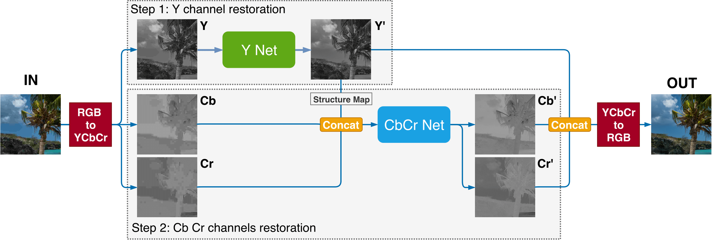

# Deep Residual Autoencoder for Blind Universal JPEG Restoration

Official implementation of the paper ["Deep Residual Autoencoder for Blind Universal JPEG Restoration".](https://ieeexplore.ieee.org/abstract/document/9050792)

Written in Pytorch v1.7.0



### Required

 - Python3.6.7+
 - This project works with PyTorch and Torchvision, then please install it following the instructions at the page [PyTorch](http://pytorch.org/)


## Inference

### Running the code

To run the code simply call
```bash
python3 ./run.py -i <path_to_image>
```
by giving the path to the images to be processed by the model.

## Cite

If you use the code provided in this repository please cite our original work:
```
@article{zini2020deep,
  title={Deep residual autoencoder for blind universal jpeg restoration},
  author={Zini, Simone and Bianco, Simone and Schettini, Raimondo},
  journal={IEEE Access},
  volume={8},
  pages={63283--63294},
  year={2020},
  publisher={IEEE}
}
```
